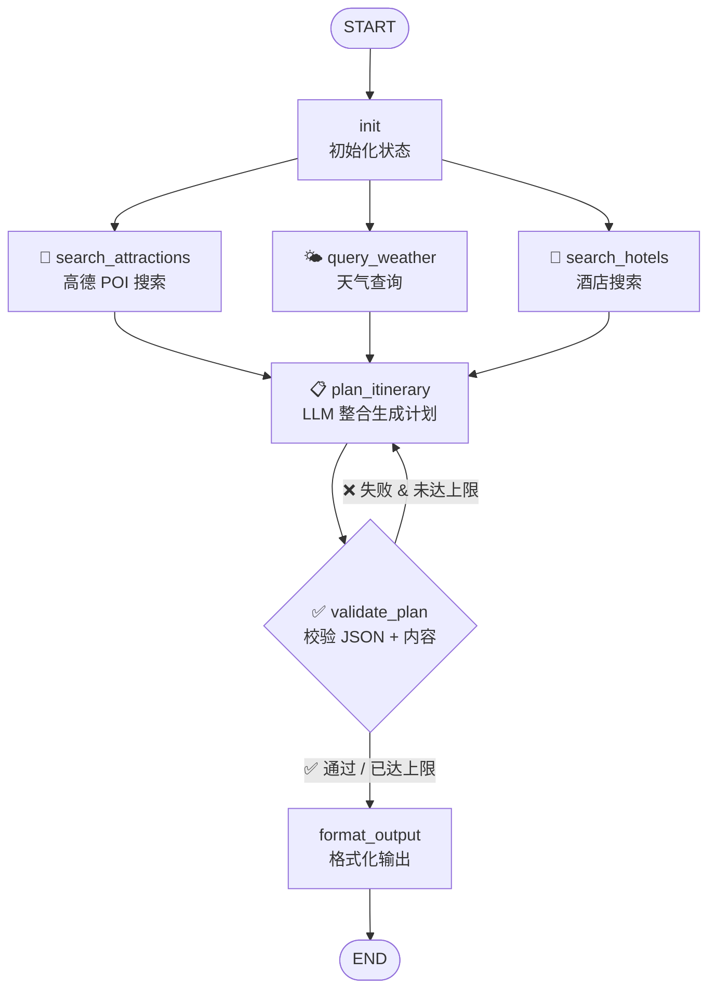

# HelloAgents Trip Planner — LangGraph 重写版 🧠⚡

> 基于 **LangGraph StateGraph** 的智能旅行规划助手，是原 HelloAgents 版本的全新架构升级。

## 🆚 与原版的核心差异

| 维度 | 原版 (HelloAgents) | LangGraph 版 |
|------|:--:|:--:|
| **编排引擎** | 手动调用 SimpleAgent | LangGraph StateGraph |
| **搜索执行** | 串行（景点→天气→酒店） | **并行**（三者同时执行） |
| **计划校验** | ❌ 无 | ✅ 结构化校验 + 自动重试 |
| **中断恢复** | ❌ | ✅ MemorySaver Checkpoint |
| **流程可视化** | ❌ | ✅ 状态图可追溯每个节点 |
| **工具集成** | MCPTool（amap-mcp-server） | 直接 HTTPS 调用高德 API |
| **LLM 接口** | HelloAgentsLLM | LangChain ChatOpenAI |

## 🏗️ 架构图



## 📁 项目结构

```
backend/
├── app/
│   ├── __init__.py
│   ├── config.py              # Pydantic Settings 配置
│   ├── models/
│   │   └── schemas.py         # Pydantic 数据模型（与原版兼容）
│   ├── agents/
│   │   └── trip_graph.py      # ★ LangGraph StateGraph 核心
│   ├── services/
│   │   ├── amap_service.py    # 高德地图 API 封装
│   │   ├── llm_service.py     # LangChain LLM 封装
│   │   └── unsplash_service.py
│   └── api/
│       ├── main.py            # FastAPI 应用
│       └── routes/
│           ├── trip.py        # 旅行规划 API
│           ├── poi.py         # POI 搜索 API
│           └── map.py         # 地图服务 API
├── run.py                     # 启动入口
├── requirements.txt
└── .env.example
```

## 🚀 快速开始

```bash
cd backend

# 1. 配置环境变量
cp .env.example .env
# 编辑 .env 填入 AMAP_API_KEY 和 OPENAI_API_KEY

# 2. 安装依赖
pip install -r requirements.txt

# 3. 启动服务
python run.py
```

服务启动后访问:
- API 文档: http://localhost:8000/docs
- 健康检查: http://localhost:8000/health

## 🔑 核心代码示例

### 状态定义
```python
class TripState(TypedDict):
    city: str
    preferences: List[str]
    attractions_data: Annotated[list, operator.add]
    weather_data: Annotated[list, operator.add]
    hotels_data: Annotated[list, operator.add]
    final_plan: dict
    retry_count: int
```

### 构建并行图
```python
graph = StateGraph(TripState)

# 三个搜索节点并行执行
graph.add_edge("init", "search_attractions")
graph.add_edge("init", "query_weather")
graph.add_edge("init", "search_hotels")

# 汇聚后规划 → 校验
graph.add_edge("search_attractions", "plan_itinerary")
graph.add_edge("query_weather", "plan_itinerary")
graph.add_edge("search_hotels", "plan_itinerary")

# 条件路由：校验失败 → 重试
graph.add_conditional_edges("validate_plan", route_after_validate, {
    "plan_itinerary": "plan_itinerary",
    "format_output": "format_output"
})
```

## 📊 性能对比

| 指标 | 原版串行 | LangGraph 并行 |
|------|:--:|:--:|
| 搜索阶段耗时 | ~6s (2+2+2) | ~2s (max of 3) |
| 计划质量 | 无校验 | 自动校验+重试 |
| 失败恢复 | 从头开始 | Checkpoint 恢复 |
| 代码可维护性 | 手动编排 | 声明式状态图 |

## 📄 许可证

与原版项目保持一致。
